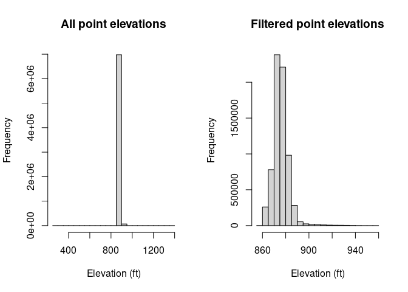
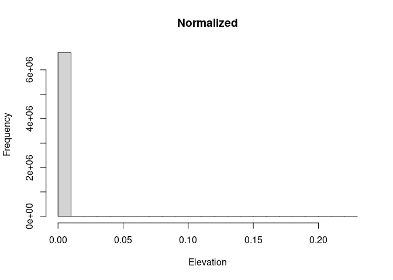
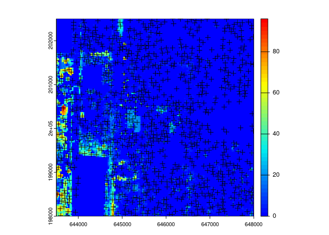
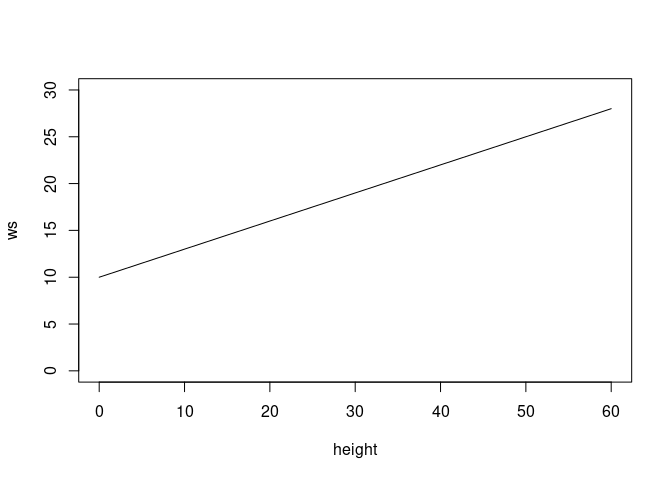
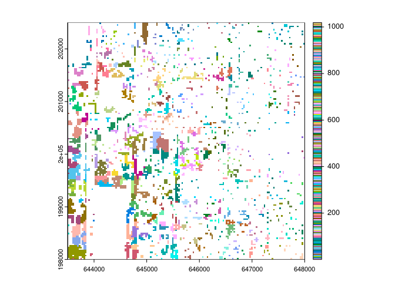
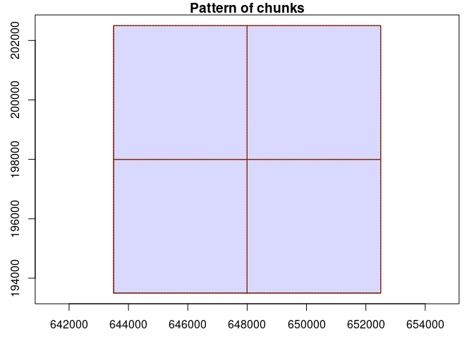

<!-- README.md is generated from README.Rmd. Please edit that file -->

# Lidar Tutorial

<!-- badges: start -->
<!-- badges: end -->

This tutorial is an introduction to working with the products of lidar
data collection from airborne platforms (e.g., drones) using the
statistical software `R`, specifically the library `lidR`. A lot of this
information and even more detail can be be found in the [excellent
online book on `lidR`](https://r-lidar.github.io/lidRbook/).

*Language:* `R`

*Packages:*

| Name        | Description                                                          | Link                                                        |
|:------------|:---------------------------------------------------------------------|:------------------------------------------------------------|
| `lidR`      | Package to view and process LiDAR point clouds in `R`                | <https://cran.r-project.org/web/packages/lidR/index.html>   |
| `future`    | Package to enable parallel processing for more efficient computation | <https://cran.r-project.org/web/packages/future/index.html> |
| `tidyverse` | Package for data manipulation and plotting functions                 | <https://www.tidyverse.org/>                                |

## Nomenclature

- *lidar:* Light Detection and Ranging, a method of remote sensing using
  pulsed lasers to measure distances.
- *pulse:* A discrete “shot” of laser emission from the LiDAR platform
  that is used to measure distance from the target surface, which in
  turn are the basis of point cloud data.
- *LAS:* A file format for storing the 3D point cloud data collected by
  LiDAR. A related file format is LAZ, which is the compressed version
  of LAS.
- *tile:*

## Data Details

We will use point cloud data collected over the [U.S. Dairy Forage
Research Center
Far](https://www.ars.usda.gov/ARSUserFiles/50901500/About%20Us%20and%20Contact%20Information/pdfs/farm%20at%20PdS.pdf)
by the [3D Elevation
Program](https://www.usgs.gov/3d-elevation-program), a program at the
USGS that is conducting nationwide LiDAR surveys.

- Repository: [USGS National
  Map](https://apps.nationalmap.gov/lidar-explorer/#/)
- Dataset name: The datasets we are using are a subset of the elev3dep
  project
  [WI_8County_2020_A20](https://rockyweb.usgs.gov/vdelivery/Datasets/Staged/Elevation/LPC/Projects/WI_8County_2020_A20/WI_8County_Sauk_2020/LAZ/)
- *Note that the data are available in the tutorial folder*

## Analysis Steps

- Load in LAS data
- Exploring the LAS data structure in `lidR`
  - Attributes
  - Plotting
- Larger geographic coverage with the `lasCatalog` in `lidR`

## Step 0: Load Libraries and data

``` r
library(lidR)
library(future)
library(tidyverse)
#> ── Attaching core tidyverse packages ──────────────────────── tidyverse 2.0.0 ──
#> ✔ dplyr     1.1.4     ✔ readr     2.1.4
#> ✔ forcats   1.0.0     ✔ stringr   1.5.1
#> ✔ ggplot2   3.4.3     ✔ tibble    3.2.1
#> ✔ lubridate 1.9.3     ✔ tidyr     1.3.1
#> ✔ purrr     1.0.2     
#> ── Conflicts ────────────────────────────────────────── tidyverse_conflicts() ──
#> ✖ dplyr::filter() masks stats::filter()
#> ✖ dplyr::lag()    masks stats::lag()
#> ℹ Use the conflicted package (<http://conflicted.r-lib.org/>) to force all conflicts to become errors

# Here is the directory on Atlas
lasdir <- "./data"

# look at the contents of the folder:
lasfiles <- list.files(lasdir, full.names=TRUE)
```

### Exploring the LAS data structure in `lidR`

Individual lidar point clouds (lasfiles) are loaded using the function
`readLAS`. Read in one of the dataset point clouds using `readLAS`:

``` r
las <- readLAS(lasfiles[1])
#> Warning: There are 223 points flagged 'withheld'.
```

If you’re using R or Rstudio on a local machine with an X11 server set
up, you can plot it in 3D using the `plot` command in `lidR`.
Unfortunately, this doesn’t seem to work in Rstudio server on Open
OnDemand.

Note that you can specify what attribute to plot using the `color`
argument. Try plotting by `Classification`.

``` r
# This won't run on Rstudio Server
# plot(las, color = "Classification")
```

## Step 1: Outlier removal

First we will do some noise removal. We will read in a new tile ignoring
the classification information to pretend it hasn’t been done yet.

We will try using the isolated voxel filter function (`ivf`). It
identifies points points that have very few pixels in their surrounding
neighborhood of volumetric pixels (‘voxel’). The `res` parameter is the
resolution (size) of the voxels defining the neighborhood, and `n`
defines threhold number of other points to be considered ‘isolated’.

``` r
las_unclass <- readLAS(lasfiles[1], select="xyzrn")
#> Warning: There are 223 points flagged 'withheld'.

las_denoise <- classify_noise(las_unclass, algorithm = ivf(res=15, n = 6))

#plot(las_denoise, color = "Classification")
```

If we were able to plot the pointcloud in 3D we would see that the `ivf`
function has identified some isolated points above and below the main
point cloud, and also identified points that are probably powerlines.

We can compare the histograms of the Z values of the points (elevation)
before and after removing noise points. Here we can see the range is
much more reasonable.

``` r
# filter out the points that were classified as noise
las_nonoise <- filter_poi(las_denoise, Classification != LASNOISE)

par(mfrow=c(1,2))

hist(las_unclass$Z, main="All point elevations", xlab="Elevation (ft)")
hist(las_nonoise$Z, main="Filtered point elevations", xlab="Elevation (ft)")
```

<!-- -->

## Step 2: Classifying the ground

Now we will try classifying the ground for this lidar tile. We’re going
to use the ground classification algorithm `pmf`, which stands for
‘progressive morphological filter’.

``` r
# we need to set up the ground classification parameters

las_gnd <- classify_ground(las_nonoise, algorithm = pmf(ws = 15, th = 9))
#> Morphological filter: 4% (1 threads)Morphological filter: 5% (1 threads)Morphological filter: 6% (1 threads)Morphological filter: 7% (1 threads)Morphological filter: 8% (1 threads)Morphological filter: 9% (1 threads)Morphological filter: 10% (1 threads)Morphological filter: 11% (1 threads)Morphological filter: 12% (1 threads)Morphological filter: 13% (1 threads)Morphological filter: 14% (1 threads)Morphological filter: 15% (1 threads)Morphological filter: 16% (1 threads)Morphological filter: 17% (1 threads)Morphological filter: 18% (1 threads)Morphological filter: 19% (1 threads)Morphological filter: 20% (1 threads)Morphological filter: 21% (1 threads)Morphological filter: 22% (1 threads)Morphological filter: 23% (1 threads)Morphological filter: 24% (1 threads)Morphological filter: 25% (1 threads)Morphological filter: 26% (1 threads)Morphological filter: 27% (1 threads)Morphological filter: 28% (1 threads)Morphological filter: 29% (1 threads)Morphological filter: 30% (1 threads)Morphological filter: 31% (1 threads)Morphological filter: 32% (1 threads)Morphological filter: 33% (1 threads)Morphological filter: 34% (1 threads)Morphological filter: 35% (1 threads)Morphological filter: 36% (1 threads)Morphological filter: 37% (1 threads)Morphological filter: 38% (1 threads)Morphological filter: 39% (1 threads)Morphological filter: 40% (1 threads)Morphological filter: 41% (1 threads)Morphological filter: 42% (1 threads)Morphological filter: 43% (1 threads)Morphological filter: 44% (1 threads)Morphological filter: 45% (1 threads)Morphological filter: 46% (1 threads)Morphological filter: 47% (1 threads)Morphological filter: 48% (1 threads)Morphological filter: 49% (1 threads)Morphological filter: 50% (1 threads)Morphological filter: 51% (1 threads)Morphological filter: 52% (1 threads)Morphological filter: 53% (1 threads)Morphological filter: 54% (1 threads)Morphological filter: 55% (1 threads)Morphological filter: 56% (1 threads)Morphological filter: 57% (1 threads)Morphological filter: 58% (1 threads)Morphological filter: 59% (1 threads)Morphological filter: 60% (1 threads)Morphological filter: 61% (1 threads)Morphological filter: 62% (1 threads)Morphological filter: 63% (1 threads)Morphological filter: 64% (1 threads)Morphological filter: 65% (1 threads)Morphological filter: 66% (1 threads)Morphological filter: 67% (1 threads)Morphological filter: 68% (1 threads)Morphological filter: 69% (1 threads)Morphological filter: 70% (1 threads)Morphological filter: 71% (1 threads)Morphological filter: 72% (1 threads)Morphological filter: 73% (1 threads)Morphological filter: 74% (1 threads)Morphological filter: 75% (1 threads)Morphological filter: 76% (1 threads)Morphological filter: 77% (1 threads)Morphological filter: 78% (1 threads)Morphological filter: 79% (1 threads)Morphological filter: 80% (1 threads)Morphological filter: 81% (1 threads)Morphological filter: 82% (1 threads)Morphological filter: 83% (1 threads)Morphological filter: 84% (1 threads)Morphological filter: 85% (1 threads)Morphological filter: 86% (1 threads)Morphological filter: 87% (1 threads)Morphological filter: 88% (1 threads)Morphological filter: 89% (1 threads)Morphological filter: 90% (1 threads)Morphological filter: 91% (1 threads)Morphological filter: 92% (1 threads)Morphological filter: 93% (1 threads)Morphological filter: 94% (1 threads)Morphological filter: 95% (1 threads)Morphological filter: 96% (1 threads)Morphological filter: 97% (1 threads)Morphological filter: 98% (1 threads)Morphological filter: 99% (1 threads)

# view classification results in 3D:

#plot(las_gnd, color = "Classification")
```

To get a better idea of how the classification worked, we can plot a
cross section in ggplot. There is a function in `R/plot_cross.r` that
can be used for this.

``` r
source("R/plot_cross.r")

plot_cross(las_gnd, transect_len = 300)
```

<!-- -->

It looks like there are buildings that are being classified as ground.
We can try adding additional parameter iterations help to take care of
the buildings.

``` r
# we will start from the unclassified version of the point cloud again

ws <- c(9, 100)
th <- seq(1, 6, length.out = length(ws))

las_pmf2 <- classify_ground(las_nonoise, algorithm = pmf(ws=ws, th=th))
#> Morphological filter: 6% (1 threads)Morphological filter: 7% (1 threads)Morphological filter: 8% (1 threads)Morphological filter: 9% (1 threads)Morphological filter: 10% (1 threads)Morphological filter: 11% (1 threads)Morphological filter: 12% (1 threads)Morphological filter: 13% (1 threads)Morphological filter: 14% (1 threads)Morphological filter: 15% (1 threads)Morphological filter: 16% (1 threads)Morphological filter: 17% (1 threads)Morphological filter: 18% (1 threads)Morphological filter: 19% (1 threads)Morphological filter: 20% (1 threads)Morphological filter: 21% (1 threads)Morphological filter: 22% (1 threads)Morphological filter: 23% (1 threads)Morphological filter: 24% (1 threads)Morphological filter: 25% (1 threads)Morphological filter: 26% (1 threads)Morphological filter: 27% (1 threads)Morphological filter: 28% (1 threads)Morphological filter: 29% (1 threads)Morphological filter: 30% (1 threads)Morphological filter: 31% (1 threads)Morphological filter: 32% (1 threads)Morphological filter: 33% (1 threads)Morphological filter: 34% (1 threads)Morphological filter: 35% (1 threads)Morphological filter: 36% (1 threads)Morphological filter: 37% (1 threads)Morphological filter: 38% (1 threads)Morphological filter: 39% (1 threads)Morphological filter: 40% (1 threads)Morphological filter: 41% (1 threads)Morphological filter: 42% (1 threads)Morphological filter: 43% (1 threads)Morphological filter: 44% (1 threads)Morphological filter: 45% (1 threads)Morphological filter: 46% (1 threads)Morphological filter: 47% (1 threads)Morphological filter: 48% (1 threads)Morphological filter: 49% (1 threads)Morphological filter: 50% (1 threads)Morphological filter: 51% (1 threads)Morphological filter: 52% (1 threads)Morphological filter: 53% (1 threads)Morphological filter: 54% (1 threads)Morphological filter: 55% (1 threads)Morphological filter: 56% (1 threads)Morphological filter: 57% (1 threads)Morphological filter: 58% (1 threads)Morphological filter: 59% (1 threads)Morphological filter: 60% (1 threads)Morphological filter: 61% (1 threads)Morphological filter: 62% (1 threads)Morphological filter: 63% (1 threads)Morphological filter: 64% (1 threads)Morphological filter: 65% (1 threads)Morphological filter: 66% (1 threads)Morphological filter: 67% (1 threads)Morphological filter: 68% (1 threads)Morphological filter: 69% (1 threads)Morphological filter: 70% (1 threads)Morphological filter: 71% (1 threads)Morphological filter: 72% (1 threads)Morphological filter: 73% (1 threads)Morphological filter: 74% (1 threads)Morphological filter: 75% (1 threads)Morphological filter: 76% (1 threads)Morphological filter: 77% (1 threads)Morphological filter: 78% (1 threads)Morphological filter: 79% (1 threads)Morphological filter: 80% (1 threads)Morphological filter: 81% (1 threads)Morphological filter: 82% (1 threads)Morphological filter: 83% (1 threads)Morphological filter: 84% (1 threads)Morphological filter: 85% (1 threads)Morphological filter: 86% (1 threads)Morphological filter: 87% (1 threads)Morphological filter: 88% (1 threads)Morphological filter: 89% (1 threads)Morphological filter: 90% (1 threads)Morphological filter: 91% (1 threads)Morphological filter: 92% (1 threads)Morphological filter: 93% (1 threads)Morphological filter: 94% (1 threads)Morphological filter: 95% (1 threads)Morphological filter: 96% (1 threads)Morphological filter: 97% (1 threads)Morphological filter: 98% (1 threads)Morphological filter: 99% (1 threads)Morphological filter: 1% (1 threads)Morphological filter: 2% (1 threads)Morphological filter: 3% (1 threads)Morphological filter: 4% (1 threads)Morphological filter: 5% (1 threads)Morphological filter: 6% (1 threads)Morphological filter: 7% (1 threads)Morphological filter: 8% (1 threads)Morphological filter: 9% (1 threads)Morphological filter: 10% (1 threads)Morphological filter: 11% (1 threads)Morphological filter: 12% (1 threads)Morphological filter: 13% (1 threads)Morphological filter: 14% (1 threads)Morphological filter: 15% (1 threads)Morphological filter: 16% (1 threads)Morphological filter: 17% (1 threads)Morphological filter: 18% (1 threads)Morphological filter: 19% (1 threads)Morphological filter: 20% (1 threads)Morphological filter: 21% (1 threads)Morphological filter: 22% (1 threads)Morphological filter: 23% (1 threads)Morphological filter: 24% (1 threads)Morphological filter: 25% (1 threads)Morphological filter: 26% (1 threads)Morphological filter: 27% (1 threads)Morphological filter: 28% (1 threads)Morphological filter: 29% (1 threads)Morphological filter: 30% (1 threads)Morphological filter: 31% (1 threads)Morphological filter: 32% (1 threads)Morphological filter: 33% (1 threads)Morphological filter: 34% (1 threads)Morphological filter: 35% (1 threads)Morphological filter: 36% (1 threads)Morphological filter: 37% (1 threads)Morphological filter: 38% (1 threads)Morphological filter: 39% (1 threads)Morphological filter: 40% (1 threads)Morphological filter: 41% (1 threads)Morphological filter: 42% (1 threads)Morphological filter: 43% (1 threads)Morphological filter: 44% (1 threads)Morphological filter: 45% (1 threads)Morphological filter: 46% (1 threads)Morphological filter: 47% (1 threads)Morphological filter: 48% (1 threads)Morphological filter: 49% (1 threads)Morphological filter: 50% (1 threads)Morphological filter: 51% (1 threads)Morphological filter: 52% (1 threads)Morphological filter: 53% (1 threads)Morphological filter: 54% (1 threads)Morphological filter: 55% (1 threads)Morphological filter: 56% (1 threads)Morphological filter: 57% (1 threads)Morphological filter: 58% (1 threads)Morphological filter: 59% (1 threads)Morphological filter: 60% (1 threads)Morphological filter: 61% (1 threads)Morphological filter: 62% (1 threads)Morphological filter: 63% (1 threads)Morphological filter: 64% (1 threads)Morphological filter: 65% (1 threads)Morphological filter: 66% (1 threads)Morphological filter: 67% (1 threads)Morphological filter: 68% (1 threads)Morphological filter: 69% (1 threads)Morphological filter: 70% (1 threads)Morphological filter: 71% (1 threads)Morphological filter: 72% (1 threads)Morphological filter: 73% (1 threads)Morphological filter: 74% (1 threads)Morphological filter: 75% (1 threads)Morphological filter: 76% (1 threads)Morphological filter: 77% (1 threads)Morphological filter: 78% (1 threads)Morphological filter: 79% (1 threads)Morphological filter: 80% (1 threads)Morphological filter: 81% (1 threads)Morphological filter: 82% (1 threads)Morphological filter: 83% (1 threads)Morphological filter: 84% (1 threads)Morphological filter: 85% (1 threads)Morphological filter: 86% (1 threads)Morphological filter: 87% (1 threads)Morphological filter: 88% (1 threads)Morphological filter: 89% (1 threads)Morphological filter: 90% (1 threads)Morphological filter: 91% (1 threads)Morphological filter: 92% (1 threads)Morphological filter: 93% (1 threads)Morphological filter: 94% (1 threads)Morphological filter: 95% (1 threads)Morphological filter: 96% (1 threads)Morphological filter: 97% (1 threads)Morphological filter: 98% (1 threads)Morphological filter: 99% (1 threads)

plot_cross(las_pmf2, transect_len = 300)
```

<!-- -->

## Step 3: Create a digital terrain model

With the ground identified, we can use this information to create a
digital terrain model (DTM). The DTM has a lot of applications, like for
modeling hydrology. In our case, we will use the DTM to normalize the
point cloud, which allows us to treat the points as if they were
collected above a flat surface. This way, the height of the point in the
point cloud corresponds to height above the ground in the real world.
This will be helpful for modeling vegetation height.

There are also several methods of making a DTM in `lidR`. We will use
the ‘triangular irregular network’ approach, which is a fast and robust
method. It uses the Delauney triangulation method, which is simple and
requires no parameters.

``` r
dtm_tin <- rasterize_terrain(las_pmf2, res = 30, algorithm = tin())
#> Delaunay rasterization[======================================------------] 77% (1 threads)Delaunay rasterization[=======================================-----------] 78% (1 threads)Delaunay rasterization[=======================================-----------] 79% (1 threads)Delaunay rasterization[========================================----------] 80% (1 threads)Delaunay rasterization[========================================----------] 81% (1 threads)Delaunay rasterization[=========================================---------] 82% (1 threads)Delaunay rasterization[=========================================---------] 83% (1 threads)Delaunay rasterization[==========================================--------] 84% (1 threads)Delaunay rasterization[==========================================--------] 85% (1 threads)Delaunay rasterization[===========================================-------] 86% (1 threads)Delaunay rasterization[===========================================-------] 87% (1 threads)Delaunay rasterization[============================================------] 88% (1 threads)Delaunay rasterization[============================================------] 89% (1 threads)Delaunay rasterization[=============================================-----] 90% (1 threads)Delaunay rasterization[=============================================-----] 91% (1 threads)Delaunay rasterization[==============================================----] 92% (1 threads)Delaunay rasterization[==============================================----] 93% (1 threads)Delaunay rasterization[===============================================---] 94% (1 threads)Delaunay rasterization[===============================================---] 95% (1 threads)Delaunay rasterization[================================================--] 96% (1 threads)Delaunay rasterization[================================================--] 97% (1 threads)Delaunay rasterization[=================================================-] 98% (1 threads)Delaunay rasterization[=================================================-] 99% (1 threads)Delaunay rasterization[==================================================] 100% (1 threads)

# plot_dtm3d(dtm_tin, bg = "white") 

plot(dtm_tin, col = gray(1:50/50))
```

<!-- -->

Another approach is to use nearest neighbor interpolation with inverse
distance weighting:

``` r
dtm_idw <- rasterize_terrain(las_pmf2, res = 30, 
                             algorithm = knnidw(k = 10, p = 2, rmax = 150))

# plot_dtm3d(dtm_idw, bg = "white") 

plot(dtm_idw, col = gray(1:50/50))
```

<!-- -->

## Step 4: Height normalization

Once we have the digital terrain model, we can use it to normalize the
heights of the point cloud.

``` r
nlas <- las_pmf2 - dtm_tin
```

It doesn’t look very different because the terrain is very flat here. We
can plot a histogram of elevation to check that ground points are now
zero. We use the `lidR` function `filter_ground` to only select ground
points and plot their Z axis:

``` r
par(mfrow=c(1,2))

hist(filter_ground(las_pmf2)$Z, main = "Not normalized", xlab="Elevation")

hist(filter_ground(nlas)$Z, main = "Normalized", xlab="Elevation")
```

<!-- -->

Notice that the ground points are centered at 0 now but they’re not all
exactly 0. This is because we normalized against the digital terrain
model, which generalizes the elevation to the pixel level. The exact
elevation at each point within the pixel is likely a little off from the
the pixel value.

Another way to normalize the point cloud is to reference the ground
points within the point cloud itself. The `normalize_height` function
uses a spatial interpolation function to create a continuous surface of
ground points to use for normalization rather than the DTM grid. We need
to give it an interpolation method, so we use the TIN method again.

``` r
nlas2 <- normalize_height(las_pmf2, tin())
#> Delaunay rasterization[=====---------------------------------------------] 10% (1 threads)Delaunay rasterization[=====---------------------------------------------] 11% (1 threads)Delaunay rasterization[======--------------------------------------------] 12% (1 threads)Delaunay rasterization[======--------------------------------------------] 13% (1 threads)Delaunay rasterization[=======-------------------------------------------] 14% (1 threads)Delaunay rasterization[=======-------------------------------------------] 15% (1 threads)Delaunay rasterization[========------------------------------------------] 16% (1 threads)Delaunay rasterization[========------------------------------------------] 17% (1 threads)Delaunay rasterization[=========-----------------------------------------] 18% (1 threads)Delaunay rasterization[=========-----------------------------------------] 19% (1 threads)Delaunay rasterization[==========----------------------------------------] 20% (1 threads)Delaunay rasterization[==========----------------------------------------] 21% (1 threads)Delaunay rasterization[===========---------------------------------------] 22% (1 threads)Delaunay rasterization[===========---------------------------------------] 23% (1 threads)Delaunay rasterization[============--------------------------------------] 24% (1 threads)Delaunay rasterization[============--------------------------------------] 25% (1 threads)Delaunay rasterization[=============-------------------------------------] 26% (1 threads)Delaunay rasterization[=============-------------------------------------] 27% (1 threads)Delaunay rasterization[==============------------------------------------] 28% (1 threads)Delaunay rasterization[==============------------------------------------] 29% (1 threads)Delaunay rasterization[===============-----------------------------------] 30% (1 threads)Delaunay rasterization[===============-----------------------------------] 31% (1 threads)Delaunay rasterization[================----------------------------------] 32% (1 threads)Delaunay rasterization[================----------------------------------] 33% (1 threads)Delaunay rasterization[=================---------------------------------] 34% (1 threads)Delaunay rasterization[=================---------------------------------] 35% (1 threads)Delaunay rasterization[==================--------------------------------] 36% (1 threads)Delaunay rasterization[==================--------------------------------] 37% (1 threads)Delaunay rasterization[===================-------------------------------] 38% (1 threads)Delaunay rasterization[===================-------------------------------] 39% (1 threads)Delaunay rasterization[====================------------------------------] 40% (1 threads)Delaunay rasterization[====================------------------------------] 41% (1 threads)Delaunay rasterization[=====================-----------------------------] 42% (1 threads)Delaunay rasterization[=====================-----------------------------] 43% (1 threads)Delaunay rasterization[======================----------------------------] 44% (1 threads)Delaunay rasterization[======================----------------------------] 45% (1 threads)Delaunay rasterization[=======================---------------------------] 46% (1 threads)Delaunay rasterization[=======================---------------------------] 47% (1 threads)Delaunay rasterization[========================--------------------------] 48% (1 threads)Delaunay rasterization[========================--------------------------] 49% (1 threads)Delaunay rasterization[=========================-------------------------] 50% (1 threads)Delaunay rasterization[=========================-------------------------] 51% (1 threads)Delaunay rasterization[==========================------------------------] 52% (1 threads)Delaunay rasterization[==========================------------------------] 53% (1 threads)Delaunay rasterization[===========================-----------------------] 54% (1 threads)Delaunay rasterization[===========================-----------------------] 55% (1 threads)Delaunay rasterization[============================----------------------] 56% (1 threads)Delaunay rasterization[============================----------------------] 57% (1 threads)Delaunay rasterization[=============================---------------------] 58% (1 threads)Delaunay rasterization[=============================---------------------] 59% (1 threads)Delaunay rasterization[==============================--------------------] 60% (1 threads)Delaunay rasterization[==============================--------------------] 61% (1 threads)Delaunay rasterization[===============================-------------------] 62% (1 threads)Delaunay rasterization[===============================-------------------] 63% (1 threads)Delaunay rasterization[================================------------------] 64% (1 threads)Delaunay rasterization[================================------------------] 65% (1 threads)Delaunay rasterization[=================================-----------------] 66% (1 threads)Delaunay rasterization[=================================-----------------] 67% (1 threads)Delaunay rasterization[==================================----------------] 68% (1 threads)Delaunay rasterization[==================================----------------] 69% (1 threads)Delaunay rasterization[===================================---------------] 70% (1 threads)Delaunay rasterization[===================================---------------] 71% (1 threads)Delaunay rasterization[====================================--------------] 72% (1 threads)Delaunay rasterization[====================================--------------] 73% (1 threads)Delaunay rasterization[=====================================-------------] 74% (1 threads)Delaunay rasterization[=====================================-------------] 75% (1 threads)Delaunay rasterization[======================================------------] 76% (1 threads)Delaunay rasterization[======================================------------] 77% (1 threads)Delaunay rasterization[=======================================-----------] 78% (1 threads)Delaunay rasterization[=======================================-----------] 79% (1 threads)Delaunay rasterization[========================================----------] 80% (1 threads)Delaunay rasterization[========================================----------] 81% (1 threads)Delaunay rasterization[=========================================---------] 82% (1 threads)Delaunay rasterization[=========================================---------] 83% (1 threads)Delaunay rasterization[==========================================--------] 84% (1 threads)Delaunay rasterization[==========================================--------] 85% (1 threads)Delaunay rasterization[===========================================-------] 86% (1 threads)Delaunay rasterization[===========================================-------] 87% (1 threads)Delaunay rasterization[============================================------] 88% (1 threads)Delaunay rasterization[============================================------] 89% (1 threads)Delaunay rasterization[=============================================-----] 90% (1 threads)Delaunay rasterization[=============================================-----] 91% (1 threads)Delaunay rasterization[==============================================----] 92% (1 threads)Delaunay rasterization[==============================================----] 93% (1 threads)Delaunay rasterization[===============================================---] 94% (1 threads)Delaunay rasterization[===============================================---] 95% (1 threads)Delaunay rasterization[================================================--] 96% (1 threads)Delaunay rasterization[================================================--] 97% (1 threads)Delaunay rasterization[=================================================-] 98% (1 threads)Delaunay rasterization[=================================================-] 99% (1 threads)Delaunay rasterization[==================================================] 100% (1 threads)
```

If we look at the histogram of ground points from this normalization, we
can see they are all at 0.

``` r
hist(filter_ground(nlas2)$Z, main = "Normalized", xlab="Elevation")
```

<!-- -->

## Step 5: Canopy Height Model

Once we have normalized the las cloud by the ground elevation, we assume
that the Z values of vegetation points represent their heights. Like the
digital terrain model, we can use this information to make a canopy
height model raster.

Like the other steps in this tutorial, `lidR` presents many options for
making the canopy height model. The simplest is using the `p2r`
algorithm, which stands for ‘point to raster’. It directly converts the
normalized point heights to raster cells.

``` r
chm <- rasterize_canopy(nlas2, res = 30, algorithm = p2r())
col <- height.colors(25)
plot(chm, col = col)
```

<!-- -->

`p2r` is very fast, but it leaves holes where there is no vegetation at
lower resolutions. `lidR` also has more complex algorithms that can deal
with these issues but this will work for our purposes. You can read more
on this in the `lidR` book.

## Step 6: Individual tree detection

We can identify individual trees using the local maximum filter
algorithm `lmf`. The filter looks in a neighborhood of points to
determine which point is highest. The parameter that determines the
search neighborhood is `ws`, which defines the diameter of the search
radius.

``` r
ttops <- locate_trees(nlas2, lmf(ws = 120))
#> Local maximum filter: [========================--------------------------] 49% (1 threads)Local maximum filter: [=========================-------------------------] 50% (1 threads)Local maximum filter: [=========================-------------------------] 51% (1 threads)Local maximum filter: [==========================------------------------] 52% (1 threads)Local maximum filter: [==========================------------------------] 53% (1 threads)Local maximum filter: [===========================-----------------------] 54% (1 threads)Local maximum filter: [===========================-----------------------] 55% (1 threads)Local maximum filter: [============================----------------------] 56% (1 threads)Local maximum filter: [============================----------------------] 57% (1 threads)Local maximum filter: [=============================---------------------] 58% (1 threads)Local maximum filter: [=============================---------------------] 59% (1 threads)Local maximum filter: [==============================--------------------] 60% (1 threads)Local maximum filter: [==============================--------------------] 61% (1 threads)Local maximum filter: [===============================-------------------] 62% (1 threads)Local maximum filter: [===============================-------------------] 63% (1 threads)Local maximum filter: [================================------------------] 64% (1 threads)Local maximum filter: [================================------------------] 65% (1 threads)Local maximum filter: [=================================-----------------] 66% (1 threads)Local maximum filter: [=================================-----------------] 67% (1 threads)Local maximum filter: [==================================----------------] 68% (1 threads)Local maximum filter: [==================================----------------] 69% (1 threads)Local maximum filter: [===================================---------------] 70% (1 threads)Local maximum filter: [===================================---------------] 71% (1 threads)Local maximum filter: [====================================--------------] 72% (1 threads)Local maximum filter: [====================================--------------] 73% (1 threads)Local maximum filter: [=====================================-------------] 74% (1 threads)Local maximum filter: [=====================================-------------] 75% (1 threads)Local maximum filter: [======================================------------] 76% (1 threads)Local maximum filter: [======================================------------] 77% (1 threads)Local maximum filter: [=======================================-----------] 78% (1 threads)Local maximum filter: [=======================================-----------] 79% (1 threads)Local maximum filter: [========================================----------] 80% (1 threads)Local maximum filter: [========================================----------] 81% (1 threads)Local maximum filter: [=========================================---------] 82% (1 threads)Local maximum filter: [=========================================---------] 83% (1 threads)Local maximum filter: [==========================================--------] 84% (1 threads)Local maximum filter: [==========================================--------] 85% (1 threads)Local maximum filter: [===========================================-------] 86% (1 threads)Local maximum filter: [===========================================-------] 87% (1 threads)Local maximum filter: [============================================------] 88% (1 threads)Local maximum filter: [============================================------] 89% (1 threads)Local maximum filter: [=============================================-----] 90% (1 threads)Local maximum filter: [=============================================-----] 91% (1 threads)Local maximum filter: [==============================================----] 92% (1 threads)Local maximum filter: [==============================================----] 93% (1 threads)Local maximum filter: [===============================================---] 94% (1 threads)Local maximum filter: [===============================================---] 95% (1 threads)Local maximum filter: [================================================--] 96% (1 threads)Local maximum filter: [================================================--] 97% (1 threads)Local maximum filter: [=================================================-] 98% (1 threads)Local maximum filter: [=================================================-] 99% (1 threads)Local maximum filter: [==================================================] 100% (1 threads)

plot(chm, col = height.colors(50))
plot(sf::st_geometry(ttops), add = TRUE, pch = 3)
```

<!-- -->

``` r

# x <- plot(nlas2, bg = "white", size = 4)
# add_treetops3d(x, ttops, radius =3)
```

The tree detection might be improved with a variable window size. This
is because we would expect shorter trees to have smaller canopies and
need a smaller window to detect, while taller trees would have wider
canopies and require a larger window. We can make a function defining
window size as a function of height and provide that to the `lmf`
function instead of a constant window size.

``` r
wsfun <- function(x) {x * 0.3 + 10}

height <- seq(0,60,5)

ws <- wsfun(height)

plot(height, ws, type = "l", ylim = c(0,30))
```

<!-- -->

And now we can try identifying trees with our variable function!

``` r
ttops2 <- locate_trees(nlas2, lmf(wsfun))

plot(chm, col = height.colors(50))
plot(sf::st_geometry(ttops2), add = TRUE, pch = 3)
```

<!-- -->

``` r

# x <- plot(nlas2, bg = "white", size = 4)
# add_treetops3d(x, ttops2, radius =3)
```

I would not say the new window function worked that well. Other
functions could be developed, and with non-linear or stepwise shapes.
Give it a try!

## Step 6b: Individual tree segmentation

We can also segment the point cloud by estimated trees. As always,
`lidR` provides several algorithm choices. Today we’ll go with
`dalponte2016`, which uses the canopy height model and estimated tree
tops we just produced. We use these data to first paramterize the
algorithm and apply it in the `segment_trees` function.

``` r
algo <- dalponte2016(chm, ttops)

treelas <- segment_trees(nlas2, algo) # segment point cloud
#> Warning: ignoring unrecognized unit: US survey foot

# plot(treelas, bg = "white", size = 4, color = "treeID") # visualize trees
```

You may not be able to visualize the output in 3D if you’re using Atlas.
We can also do a raster-based tree segmentation.

``` r
crowns <- algo()
#> Warning: ignoring unrecognized unit: US survey foot

plot(crowns, col = pastel.colors(200))
```

<!-- -->

## Bonus: Processing tiled datasets

`lidR` can handle tiled datasets in a nice way. You can load a folder of
las files as tiles using the \`readLAScatalog\`\` function.

``` r
ctg <- readLAScatalog(lasdir)
```

When this is plotted, `lidR` shows the coverages of the tiles.

``` r
plot(ctg)
```

<!-- -->

When processing LAScatalog data, `lidR` will work with individual chunks
of the larger dataset. But it will also take into account a buffer area
of nearby tiles so that there aren’t edge artifacts. These buffers are
adjustable. You can view them below.

``` r
plot(ctg, chunk=TRUE)
```

<!-- -->

``` r

# chunk size:
opt_chunk_buffer(ctg)
#> [1] 30

# change chunk size
# opt_chunk_size(ctg) <- 0 # 1500 ft chunks

# change buffer width
# opt_chunk_buffer(ctg) <- 30 # 100 ft buffer
```

Processing LAScatalogs is similar to LAS in `lidR` except they sometimes
need an extra step of defining an output file template. This could be a
temporary file, like so:

``` r
dir.create("./temp")

opt_output_files(ctg) <- paste0("./temp/{*}_chm")

# now you can run one of the above processes, like classify canopy:

ctg_chm <- rasterize_canopy(ctg, res = 30, algorithm = p2r(), overwrite=TRUE)
#> Warning: There are 223 points flagged 'withheld'.
#> Chunk 1 of 4 (25%): state ⚠
#> Warning: There are 61 points flagged 'withheld'.
#> Chunk 2 of 4 (50%): state ⚠
#> Warning: There are 219 points flagged 'withheld'.
#> Chunk 3 of 4 (75%): state ⚠
#> Warning: There are 458 points flagged 'withheld'.
```

<!-- -->

    #> Chunk 4 of 4 (100%): state ⚠

You can use parallel processing to process multiple chunks
simultaneously, using the `future` package. Using the `future::plan`
function, you can assign multiple workers to handle separate tiles.

``` r
# Check how many cores available
availableCores()
#> system 
#>     10

# set up multisession 
plan(multisession, workers=2)

# set up file template again

opt_output_files(ctg) <- paste0("./temp/{*}_classified")

# run your favorite lidR process in parallel on the LAScatalog! e.g., classify ground

ctg_chm <- rasterize_terrain(ctg, res = 30, algorithm = tin(), overwrite=TRUE)
```

<!-- -->

    #> Chunk 1 of 4 (25%): state ✓
    #> Chunk 2 of 4 (50%): state ✓
    #> Chunk 3 of 4 (75%): state ✓
    #> Chunk 4 of 4 (100%): state ✓

At the same time, some functions in `lidR` also have built-in parallel
capabilities. You can check this by running `is.parallelised` on the
function. If a function is parallelized, you can set the number of
threads to use with `set_lidr_threads` if the machine has OpenMP support
(which the Atlas does). But keep in mind that you have to balance these
threads with chunk parallelization if you’re running them at the same
time. So if a process is using two threads, but is processing two chunks
in parallel, then a total of four threads are needed.

``` r

# Check if tin function is parallelized:
is.parallelised(tin())

# How many threads is lidR using?
get_lidr_threads()

# Change how many threads lidR is using (Only works with OpenMP support)
set_lidr_threads(2)

# check how many workers are reserved for `future`
# (you set up future workers earlier with `plan(multisession, workers=2))`

future::nbrOfFreeWorkers()

# do you have enough cores?
availableCores() >= nbrOfFreeWorkers()*get_lidr_threads()
```

## References

Guo, Q., Su, Y., Hu, T., Guan, H., Jin, S., Zhang, J., Zhao, X., Xu, K.,
Wei, D., Kelly, M., & Coops, N. C. (2021). Lidar Boosts 3D Ecological
Observations and Modelings: A Review and Perspective. IEEE Geoscience
and Remote Sensing Magazine, 9(1), 232–257.
<https://doi.org/10.1109/MGRS.2020.3032713>

Roussel, J.-R., Goodbody, T. R. H., & Tompalski, P. (2023). The lidR
package. <https://r-lidar.github.io/lidRbook/>
